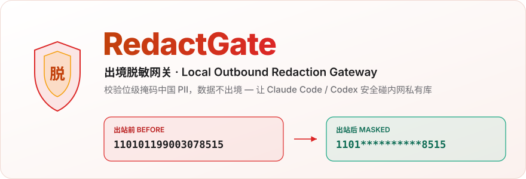
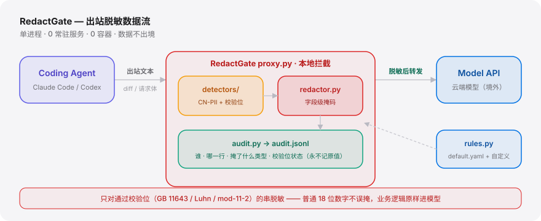

<div align="right"><sub><a href="./README.en.md">English</a>&nbsp;&nbsp;⇄&nbsp;&nbsp;<b>简体中文</b></sub></div>

<p align="center">
  <picture>
    <source media="(prefers-color-scheme: dark)" srcset="./assets/hero-dark.svg">
    <source media="(prefers-color-scheme: light)" srcset="./assets/hero-light.svg">
    
  </picture>
</p>

<p align="center"><sub>给 Claude Code / Codex 等云端 Coding Agent 接的本地出站脱敏网关：出境前对中国 PII 做校验位级字段脱敏并落审计日志，让数据不出境。</sub></p>

<p align="center">
  <a href="./LICENSE"></a>
  <a href="https://github.com/SuperMarioYL/redactgate/releases"></a>
  <a href="https://github.com/SuperMarioYL/redactgate/actions/workflows/ci.yml"></a>
  
  
  
</p>

**痛点 → 解法：** 云端 Coding Agent 把混着身份证、手机号的源文件整段发给境外模型，你无从拦截；RedactGate 坐在 Agent 与模型之间，出境前**只对通过校验位的中国 PII**做字段级掩码，业务逻辑原样进模型，每一次脱敏都落进审计日志。

```bash
pip install redactgate
redactgate scan examples/demo-repo/leaky.py     # 列出每个命中的行号/类型/校验位状态
redactgate proxy --stdin < examples/demo-repo/leaky.py | head   # 出境前掩码
```

---

## 目录

- [架构](#架构)
- [为什么需要它](#为什么需要它)
- [安装](#安装)
- [快速开始](#快速开始)
- [用法](#用法)
- [演示](#演示)
- [配置](#配置)
- [付费版（团队版 / 企业版）](#付费版团队版--企业版)
- [路线图](#路线图)
- [对比](#对比-vs-codex-文件级排除)
- [许可证](#许可证)

---

<h2 id="架构"> 架构</h2>

单进程 CLI，无外部服务、无数据库、无容器。三个责任面：**拦截**（`proxy.py`）、**识别 + 掩码**（`detectors/` + `redactor.py`）、**留痕**（`audit.py`）。

<p align="center">
  <picture>
    <source media="(prefers-color-scheme: dark)" srcset="./assets/atlas-dark.svg">
    <source media="(prefers-color-scheme: light)" srcset="./assets/atlas-light.svg">
    
  </picture>
</p>

<h2 id="为什么需要它"> 为什么需要它</h2>

中国企业（银行、政企、fintech）的开发者被要求用云端 Coding Agent，可内网仓库里一个源文件常常**混着想发给模型的业务逻辑、和个保法/数据安全法禁止出境的硬编码身份证或内网域名**。Codex 的文件级排除（[issue #2847](https://github.com/openai/codex/issues/2847)，133 HN 分仍未实现）粒度太粗——该发的整文件被挡、该掩的字段又混在里面；gitleaks / trufflehog 只扫密钥、跑在 CI 而非 Agent↔模型在途链路，且不校验身份证 GB 11643 / 统一社会信用代码 mod-11-2。

RedactGate 把脱敏放在 Agent 真正操作的**字段（diff hunk）粒度**：业务逻辑照常到达模型，受监管的 PII 被替换成稳定的占位符。可辩护的新原语 = **校验位校验的中国 PII 识别器 + 字段级 diff 掩码 + 出站审计三元组**——只对**通过校验位**的串脱敏，把"每个 18 位数字都误掩"的误报压到可用水平。这正是 [affaan-m/everything-claude-code](https://github.com/affaan-m/everything-claude-code) 这类 Claude Code 生态合集里缺的一块：让云端 **Agent** 安全地碰内网私有库。

<h2 id="安装"> 安装</h2>

```bash
pip install redactgate          # 需要 Python 3.12+
# 国内镜像更快：
pip install -i https://pypi.tuna.tsinghua.edu.cn/simple redactgate
```

从源码：

```bash
git clone https://github.com/SuperMarioYL/redactgate.git
cd redactgate && pip install -e ".[dev]" && pytest
```

<h2 id="快速开始"> 快速开始</h2>

冷启动到首个可见结果只需三条命令——零配置即见效：

```bash
pip install redactgate
redactgate scan examples/demo-repo/leaky.py                       # 1) 看清哪里有 PII
redactgate proxy --stdin < examples/demo-repo/leaky.py | head     # 2) 出境前掩码
```

<details>
<summary>示例输出（scan）</summary>

```
            CN-PII in examples/demo-repo/leaky.py
 Line  Col  Type             类型                Checksum  Confidence
   12    42  id_card          身份证                  ✓          0.99
   25    12  intranet_domain  内网域名                 —          0.85
   26    15  intranet_domain  内网域名                 —          0.90
   32    17  id_card          身份证                  ✓          0.99
   33    15  phone            手机号                  —          0.80
   34    19  bank_card        银行卡                  ✓          0.90
   40    14  uscc             统一社会信用代码           ✓          0.97
   41    23  phone            手机号                  —          0.80
8 hit(s) — checksum-validated only.
```

身份证 / 银行卡 / 统一社会信用代码三类带 `✓`，是真正过了校验位的（GB 11643 / Luhn / mod-11-2）；手机号 / 内网域名按号段 / 格式判定，故 Checksum 列为 `—`。第 35 行 `order_id = "110101199003078500"`：18 位但**校验位不对**，所以**不会**被命中，避免误掩普通编号。

</details>

<h2 id="用法"> 用法</h2>

三个子命令覆盖 v0.1 全链路。完整可跑示例见 [`examples/`](./examples/)。

**1. `scan` — 把一个文件里的 CN-PII 列出来（库 / 预提交钩子均可）**

```bash
redactgate scan path/to/file.py            # 表格输出，命中时退出码非 0（便于 CI 拦截）
redactgate scan path/to/file.py --json     # 每行一个 JSON，便于脚本消费
```

**2. `proxy` — 出站脱敏面（stdin 过滤器 或 本地 HTTP 转发代理）**

```bash
# stdin 过滤：把脱敏后的文本写到 stdout，命中追加进 audit.jsonl
redactgate proxy --stdin < outbound.txt > masked.txt

# HTTP 代理：起一个本地转发代理，把 Agent 的模型客户端指过来
redactgate proxy --listen 127.0.0.1:8888
export HTTPS_PROXY=http://127.0.0.1:8888   # 出站请求体在转发前被字段级掩码
```

**3. `report` — 出境脱敏汇总（合规自查可直接交）**

```bash
redactgate report                          # 读取 audit.jsonl，按类型/动作汇总
redactgate report --audit ./logs/audit.jsonl
```

库调用：

```python
from redactgate.redactor import redact_text

result = redact_text(open("leaky.py", encoding="utf-8").read())
print(result.count, "field(s) masked")     # 字段级掩码，业务逻辑原样保留
print(result.text)                          # 已脱敏的缓冲区
```

<h2 id="演示"> 演示</h2>

脱敏前/后 diff 对照：planted 身份证 `110101199003078515` 在出站前被掩成 `1101**********8515`，业务逻辑原样保留。

<p align="center">
  
</p>

<h2 id="配置"> 配置</h2>

零配置即可用；要定制就写一份 YAML 用 `--rules my.yaml` 合并到内置 [`rules/default.yaml`](./rules/default.yaml) 之上（标量覆盖、`detectors` 按类型合并、`allowlist` / `custom_patterns` 追加）。顶层键：

| 键 | 类型 | 默认 | 含义 |
|---|---|---|---|
| `default_policy` | `mask` \| `block` | `mask` | 命中后的默认动作：`mask` 字段级替换；`block` 整条出站请求拦下（仅代理） |
| `min_confidence` | float | `0.5` | 低于此置信度的命中不处理 |
| `masking.style` | `partial` \| `full` \| `label` | `partial` | `partial` 保留头尾（`1101**********8515`）；`full` 整段掩码；`label` 替换成 `[身份证-已脱敏]` |
| `masking.keep_prefix` / `keep_suffix` | int | `4` / `4` | `partial` 下保留的头/尾字符数 |
| `detectors.<type>.enabled` | bool | `true` | 关闭某类识别器（`id_card` / `phone` / `bank_card` / `uscc` / `intranet_domain`） |
| `allowlist` | list | `[]` | 永不脱敏的字面值/模式（如测试固定值） |

<h2 id="付费版团队版--企业版"> 付费版（团队版 / 企业版）</h2>

开源核心（本地代理 + 中国 PII 校验库）**自托管永久免费**，用于获客与信任。合规团队真正要的"集中管控 + 可交付报告"在付费版：

| 版本 | 适合 | 能力 | 价位（估算） |
|---|---|---|---|
| **开源版** | 个人 / 单团队自托管 | 代理 + scan + 字段级掩码 + JSONL 审计 | 免费 |
| **团队版** | 银行 / 政企 / fintech 研发团队 | 集中规则下发 · 合并审计日志 · **阻断式策略**（非仅掩码）· 出境脱敏合规报告导出 · SSO | ¥4,800/团队/年（≤10 席）或 ¥980/席/年 |
| **企业版** | 信创 / 私有化采购 | 团队版全部 + 私有化部署 + 信创环境适配 + 行业自定义 PII 规则包 + 支持 SLA | ¥60,000+/年起 |

> "数据不出境"读者天然排斥托管——付费层只经手**策略 / 审计元数据**，绝不经手你的代码。计费走微信支付 / 支付宝 / 对公转账，不用境外 Stripe。
> 团队版 / 私有化咨询：在仓库提一个 issue 或邮件标题写「RedactGate 团队版」。

<h2 id="路线图"> 路线图</h2>

- [x] **m1** — 校验位校验的 CN-PII 识别器（身份证 / 手机号 / 银行卡 / 统一社会信用代码 / 内网域名）作为纯库 + `redactgate scan`
- [x] **m2** — `redactgate proxy` 出站拦截 + 字段级 diff 掩码 + JSONL 审计
- [x] **m3** — 可 `pip install`、内置 `default.yaml`、`redactgate report` 汇总、双语 README + demo GIF
- [ ] 团队版：集中规则下发 + 合并审计 + 阻断式策略
- [ ] 企业版：私有化部署 + 信创环境适配 + 合规报告导出
- [ ] 非中国 PII（美国 SSN、GDPR EU 格式）
- [ ] 入站（模型→仓库）扫描

<h2 id="对比-vs-codex-文件级排除"> 对比 vs Codex 文件级排除</h2>

诚实对照 [openai/codex #2847](https://github.com/openai/codex/issues/2847) 的文件级排除诉求：

| 能力 | RedactGate | Codex 文件级排除（#2847） |
|---|:---:|:---:|
| 已实现、现在可用 | ✓ | — （仍 open） |
| 字段级 / diff-hunk 粒度（业务逻辑照样进模型） | ✓ | ✗（整文件排除） |
| 校验位校验中国 PII（GB 11643 / Luhn / mod-11-2） | ✓ | ✗ |
| 出站审计日志（合规自查可交） | ✓ | ✗ |
| 与 Agent 深度原生集成 | 部分（显式代理 / 包装） | ✓（官方一旦实现将原生） |

上游一旦把 #2847 做成字段级并开放 PII 钩子，护城河收窄到"中国 PII 校验库 + 信创合规叙事"——我们对此保持诚实（见 [analysis](#为什么需要它)）。

<h2 id="许可证"> 许可证</h2>

[MIT](./LICENSE)。欢迎提 [issue](https://github.com/SuperMarioYL/redactgate/issues) 或 PR——尤其是新的行业 PII 规则与误报样本。

## Share this

```
RedactGate — 给 Claude Code 接的本地出站脱敏网关：出境前校验位级掩码身份证/手机号，数据不出境。让云端 Agent 安全碰内网私有库。 https://github.com/SuperMarioYL/redactgate
```

---

<p align="center"><sub><a href="./LICENSE">MIT</a> © 2026 SuperMarioYL</sub></p>
